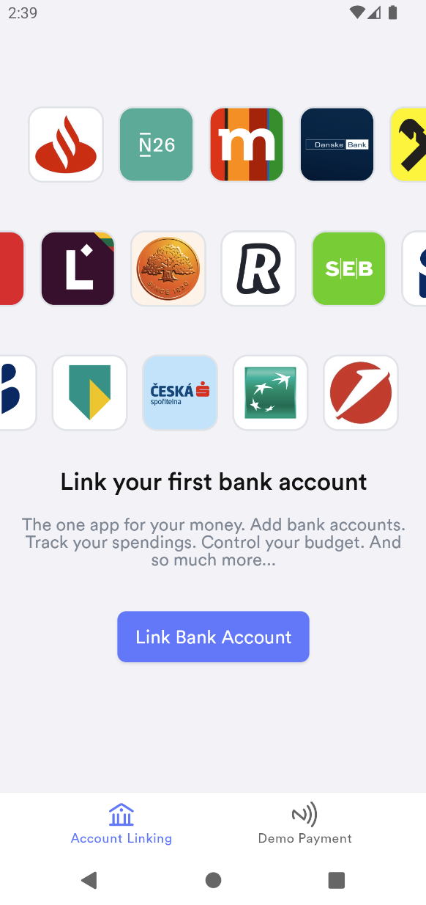
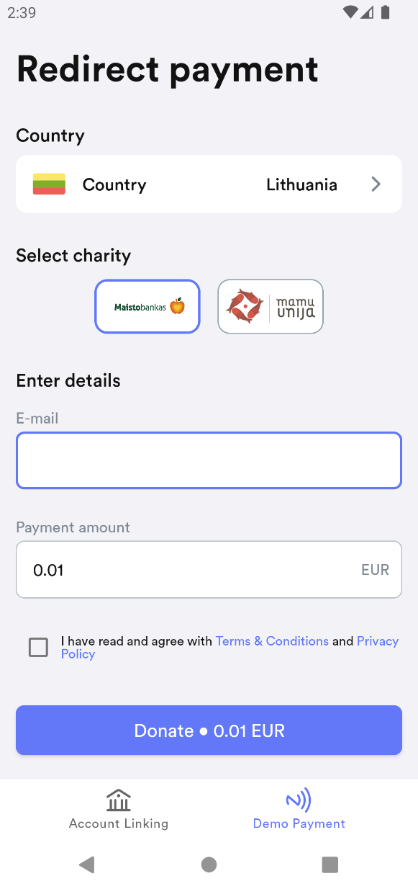

kevin. Android SDK Demo is showcase of a fully featured Android application utilising kevin. SDK

If you are a developer just looking to quickly get started with implementing the SDK in your project, we recommend starting with our [kevin. SDK](https://github.com/getkevin/kevin-android) samples.

   
   

